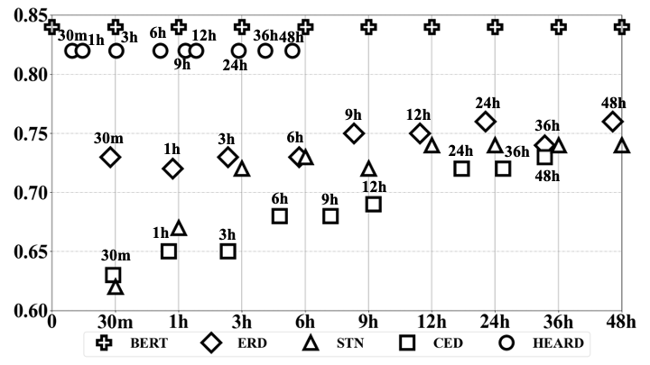
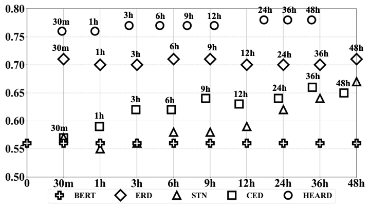

# Early Rumor Detection Using Neural Hawkes Process with a New Benchmark Dataset (Accepted at NAACL 2022) 

This is the official repository of EArly Rumor Detection (EARD) model HEARD and the early detection benchmark dataset BEARD. 

- BEARD is the first EARD-oriented dataset, collected by including early-stage information relevant to the concerned claims from a fact-checking website [Snopes](https://www.snopes.com/fact-check/). BEARD contains 1,198 rumors and non-rumors reported during 2015/03-2021/01 with around 3.3 million relevant posts. 
- HEARD is a novel EARD model based on the Neural Hawkes Process to automatically determine an optimal time point for stable early detection.

<p align="center">

</p>


## Requirements

To install requirements:

```setup
pip install -r requirements.txt
```

## Training

To train HEARD with default hyperparameters, run this command:

```
python -u Main.py
```
After training, it will automatically output the results in terms of accuracy, recall, precision, recall, early rate and SEA.
You may also set the hyperparameters and data dir in `config.json` to train your custom dataset and hyperparameters.

## Evaluation
By setting *evaluate_only* in `config.json`to true, you can use the same command ```python -u Main.py``` to test the trained model without training.

## Datasets
| Dataset  |   Class  |  #instance   | #post | #AvgLen (hrs)|
| :-------- | :-------- | :-------- | :-------------| :-------------|
| TWITTER  | rumor | 498 | 182,499 | 2,538    |
|         | non-rumor| 494 | 48,064 | 1,456  |
| PHEME| rumor      | 1,972 | 31,230 | 10 |
| | non-rumor | 3,830 | 71,210 | 19 |
| BEARD| rumor      | 531 | 2,644,807 | 1,432 |
| | non-rumor | 667 | 657,925 | 1,683 |

## Results

HEARD achieves the following performance on general classification metrics(accuracy and F1 score) and EARD-specific metrics(early rate and SEA):

| **Dataset** | **Acc**            | **F1**             | **ER**             | **SEA**            |
|:-----------:|:---------:|:------------------:|:------------------:|:------------------:|
|     TWITTER        | 0\.716 | 0\.714 | 0\.348             | 0\.789 |
|     PHEME        | 0\.823             | 0\.805             | 0\.284             | 0\.841 |
|      BEARD       | 0\.789 | 0\.788 | 0\.490             | 0\.765 |

 Results of Early Detection Accuracy Over Time:

<p align="left">
 TWITTER
<br>
  
</p>

<p align="left">
 PHEME
<br>
  
</p>
<p align="left">
  BEARD
<br>
  
</p>

## BEARD Dataset
This section aims to help users obtain the public BEARD dataset, which consists of claims, queries and relevant tweets (in the form of Tweet IDs, timestamps and post embeddings), and prepare for the input data for our HEARD model. 
### Obtain BEARD dataset
Relevant files can be found in BEARD.zip and [link](https://drive.google.com/drive/folders/1lCl9k9MnheVgHzLNLNr6Jblrb2ujbYxZ?usp=sharing).
#### BEARD_info.json
This file provides the claim information and search query for [Twitter search](https://twitter.com/search-advanced?lang=en) we used to gather the dataset. Each key-value pair of an instance contains: instance id, claim content, query and claim publish time. The data format is:
 ```
 {
    "instance id": {"claim": claim, "seed query":[sub_query,sub_query...],"time":time }
 }
 Rumor's instance id starts with "S" while Non-Rumor's instance id starts with "N".
 ```
#### BEARD.json
This file contains tweet ids for 1198 instances. The data format is as follows:
 ```
 {
    "instance id": {"eid": instance id, "post_ids":[id,id...] }
 }
 ```
#### BEARD_trees.json
This [file](https://drive.google.com/drive/folders/1lCl9k9MnheVgHzLNLNr6Jblrb2ujbYxZ?usp=sharing) contains the tree structure of each conversation of each instance. The data format is as follows:
 ```
 {
    "instance id": {"tree": {root1 id:{reply1 id:{...},reply2 id:{...}...},...}, "parent_mappings":{root1 id:{child1 id:parent1 id,...}}} }
 }
 ```
An instance may consist of multiple trees, each representing a conversation. Each tree comprises a root post and replies within the conversation. "parent_mappings" denotes the mappings of child posts to their respective parent posts, indicating which reply post corresponds to which parent post.
#### BEARD_timestamps.json
This [file](https://drive.google.com/drive/folders/1lCl9k9MnheVgHzLNLNr6Jblrb2ujbYxZ?usp=sharing) contains the timestamp of each post. The data format is as follows:
 ```
 {
    "instance id": {post id: timestamp}
 }
 ```
#### post_embs.zip
This [folder](https://drive.google.com/drive/folders/1lCl9k9MnheVgHzLNLNr6Jblrb2ujbYxZ?usp=sharing) contains the BERT embeddings of each post. The folder structure is as follow:
```
- BEARD_emb
   - instance id
      - post_id.json
```

The data format of post_id.json file is as follows:
 ```
 {
   "pooler_output":pooler_output
 }
 ```

### Prepare input data
After obtaining the tweets content, user needs to prepare input data for the HEARD model. User can follow [BERTweet](https://aclanthology.org/2020.emnlp-demos.2/)[[code](https://github.com/VinAIResearch/BERTweet)] to pre-process the text and this [example](https://scikit-learn.org/stable/modules/generated/sklearn.feature_extraction.text.TfidfVectorizer.html) to generate tf-idf vectors. Alternatively, user can refer to our example code in ```data_process.py```.

After the above steps, input instance should be in the following format that will be fed into our HEARD model:
 ```
  {
  "eid": {
          "label": "1", # 1 for rumor, 0 for non-rumor
          "merge_seqs": { 
              "merge_times": [[timestamp,timestamp,...], [timestamp,timestamp,...], ...],
              "merge_tids": [[post_id,post_id,...], [post_id,post_id,...], ...],
              'merge_vecs': [[...], [...], ...], # tf-idf vecs[1000] for each interval, so the shape of merge_vecs should be [num of intervals,1000] 
              }}
  ...
  }
  ```

## Citation

If you use this code in your research, please cite our [paper]().

```
@inproceedings{zeng-gao-2022-early,
    title = "{E}arly Rumor Detection Using Neural {H}awkes Process with a New Benchmark Dataset",
    author = "Zeng, Fengzhu  and
      Gao, Wei",
    booktitle = "Proceedings of the 2022 Conference of the North American Chapter of the Association for Computational Linguistics: Human Language Technologies",
    month = jul,
    year = "2022",
    address = "Seattle, United States",
    publisher = "Association for Computational Linguistics",
    url = "https://aclanthology.org/2022.naacl-main.302",
    pages = "4105--4117"
}
```

## Contact for issues
- Fengzhu Zeng, fzzeng.2020@phdcs.smu.edu.sg
- Wei Gao, weigao@smu.edu.sg

## References & Open sources

- **BERT** : [[BERT]](https://aclanthology.org/N19-1423.pdf)[[code]](https://github.com/huggingface/transformers), [[earliest rumor detection task]](https://link.springer.com/chapter/10.1007/978-3-030-88480-2_45#:~:text=Inspired%20by%20rumor%20psychology%2C%20we,features%20compared%20with%20non%2Drumor.)
- **CED** : [[paper]](https://arxiv.org/pdf/1811.04175.pdf), [[code]](https://github.com/thunlp/CED)
- **ERD** : [[paper]](https://aclanthology.org/N19-1163/), [[code]](https://github.com/DeepBrainAI/ERD)
- **STN** : [[paper]](https://aclanthology.org/2020.emnlp-main.727/)
- **NHP** : [[paper]](https://arxiv.org/abs/1612.09328), [[code]](https://github.com/hongyuanmei/neurawkes)
- **TWITTER dataset** : [[paper]](https://www.ijcai.org/Proceedings/16/Papers/537.pdf)
- **PHEME dataset** : [[paper]](https://arxiv.org/pdf/1610.07363.pdf)
